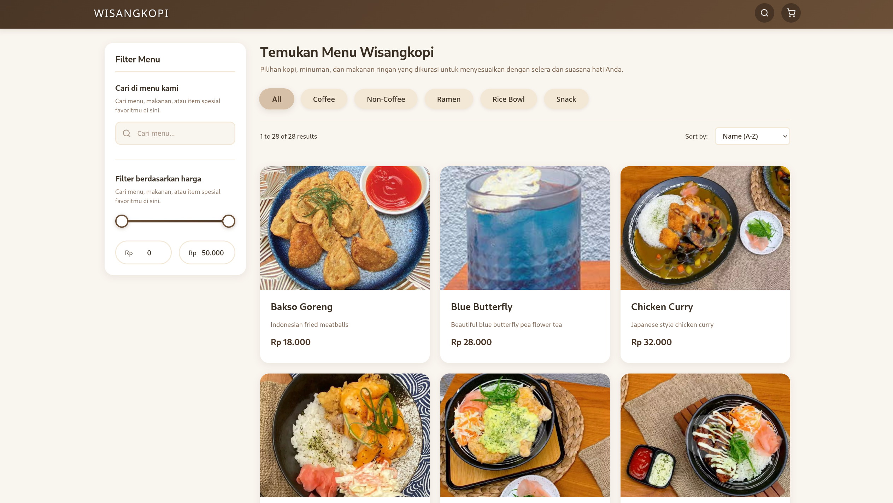

# Transdig Menu - Sistem Menu Digital & Pemesanan

<div align="center">
  
  <p><b>Preview Website</b></p>
</div>

## Tech Stack

- React
- Vite
- JavaScript
- CSS

## Sebelum Instalasi

Sebelum memulai, pastikan Anda telah menginstal:
- Node.js (versi 14.0 atau lebih tinggi)
- npm (versi 6.0 atau lebih tinggi) atau yarn

## Instalasi

Ikuti langkah-langkah berikut untuk menjalankan website secara lokal:

1. Clone repository
```bash
git clone https://github.com/kuenobaikbanget/transdig-menu.git
cd transdig-menu
```

2. Install dependencies
```bash
npm install
```

3. Jalankan development server
```bash
npm run dev
```

4. Buka browser Anda dan pergi ke
```
http://localhost:5173
```


